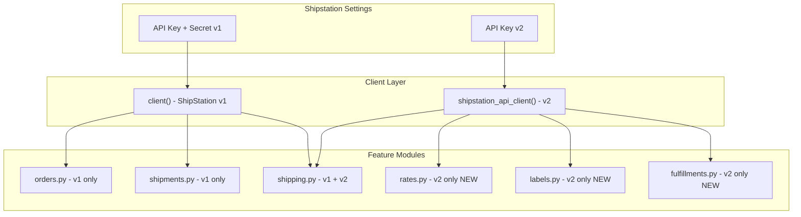

# ShipStation API v2 Integration Plan

## Overview

This plan adds support for the ShipStation API v2 (formerly ShipEngine) alongside the existing ShipStation v1 integration. The v2 API provides access to additional carriers, rate comparison, and direct label generation without requiring full order management through ShipStation.

## Architecture



## Key Differences Between APIs

| Feature | ShipStation v1 | ShipStation API v2 |

|---------|---------------|-------------------|

| Authentication | API Key + Secret (Basic Auth) | Single API Key (Bearer) |

| Rate Shopping | Via order context | Direct rate comparison |

| Label Generation | Requires order in ShipStation | Direct from shipment data |

| Carriers | Connected to ShipStation account | Direct carrier access |

| Webhooks | Store-based | Environment-based |

## Implementation Steps

### Phase 1: Core Infrastructure

**1. Update Dependencies**

Add the `shipengine` Python SDK to [`pyproject.toml`](shipstation_integration/pyproject.toml):

```python
dependencies = [
    "shipstation-client @ git+https://github.com/AgriTheory/shipstation-client.git@master#egg=shipstation-client",
    "shipengine>=1.0.0",  # NEW
    "test_utils @ git+https://github.com/AgriTheory/test_utils.git@main#egg=test_utils",
]
```

**2. Extend Shipstation Settings DocType**

Update [`shipstation_settings.json`](shipstation_integration/shipstation_integration/doctype/shipstation_settings/shipstation_settings.json):

- Add `shipstation_api_key` (Password field) for v2 API
- Add `enable_shipstation_api` (Check field) to toggle v2 features
- Add `shipstation_api_carrier_data` (Code field) for v2 carrier cache

**3. Add v2 Client Method**

Extend [`shipstation_settings.py`](shipstation_integration/shipstation_integration/doctype/shipstation_settings/shipstation_settings.py):

```python
from shipengine import ShipEngine

def shipstation_api_client(self):
    """Returns a ShipEngine client for ShipStation API v2."""
    api_key = self.get_password("shipstation_api_key")
    if not api_key:
        frappe.throw(_("ShipStation API key not configured"))
    return ShipEngine(api_key)
```

### Phase 2: Rate Comparison Feature

**4. Create rates.py Module**

New file at `shipstation_integration/rates.py`:

- `get_rates(shipment_data, settings)` - Get rate quotes from multiple carriers
- `estimate_rates(from_address, to_address, weight)` - Quick rate estimation
- `get_rate_by_id(rate_id)` - Retrieve a cached rate

This enables showing rate options in the Delivery Note UI before purchasing labels.

### Phase 3: Label Generation Enhancement

**5. Extend shipping.py for v2 Label Creation**

Update [`shipping.py`](shipstation_integration/shipping.py) to support both APIs:

```python
def _create_shipping_label_v2(doc, values, user=""):
    """Create label using ShipStation API v2 with rate_id."""
    settings = get_shipstation_settings(doc)
    client = settings.shipstation_api_client()
    
    # Option 1: Create from pre-selected rate
    if values.rate_id:
        label = client.create_label_from_rate(rate_id=values.rate_id)
    # Option 2: Create directly from shipment
    else:
        shipment = build_shipment_payload(doc, values)
        label = client.create_label_from_shipment(shipment)
    
    return process_label_response(label, doc)
```

**6. Create labels.py Module**

New file at `shipstation_integration/labels.py`:

- `create_label(shipment_data)` - Direct label purchase
- `create_label_from_rate(rate_id)` - Purchase using cached rate
- `void_label(label_id)` - Void a purchased label
- `get_label(label_id)` - Retrieve label details and PDF

### Phase 4: Fulfillments Support

**7. Create fulfillments.py Module**

New file at `shipstation_integration/fulfillments.py`:

- `create_fulfillment(delivery_note)` - Mark order as fulfilled with tracking
- `list_fulfillments(filters)` - Query fulfillment history

This enables pushing fulfillment data back to connected marketplaces.

### Phase 5: v2 Webhook Support

**8. Extend webhook_receiver.py**

Update [`webhook_receiver.py`](shipstation_integration/webhook_receiver.py):

```python
@frappe.whitelist(allow_guest=True)
def shipstation_api_webhook():
    """Handle ShipStation API v2 webhooks (batch completion, tracking, etc.)."""
    data = frappe.local.form_dict or json.loads(frappe.local.request.data)
    event_type = data.get("event")
    
    handlers = {
        "batch": handle_batch_complete,
        "track": handle_tracking_update,
    }
    
    if handler := handlers.get(event_type):
        handler(data)
```

**9. Add v2 Webhook Registration**

Extend settings to register v2 webhooks at `/v2/environment/webhooks`:

```python
def add_v2_webhooks(self):
    if not self.enable_shipstation_api:
        return
    
    client = self.shipstation_api_client()
    WEBHOOK_URL = f"{frappe.utils.get_url()}/api/method/shipstation_integration.webhook_receiver.shipstation_api_webhook"
    
    client.create_webhook({
        "url": WEBHOOK_URL,
        "event": "batch",
    })
```

### Phase 6: UI Enhancements

**10. Update Delivery Note JS**

Extend [`delivery_note.js`](shipstation_integration/public/js/delivery_note.js):

- Add "Get Rates" button to fetch and display rate options
- Show carrier/service options with pricing
- Allow selection before label purchase

**11. Update Settings JS**

Extend [`shipstation_settings.js`](shipstation_integration/shipstation_integration/doctype/shipstation_settings/shipstation_settings.js):

- Add validation for v2 API key
- Add "Test Connection" button for v2
- Add "Fetch Carriers" button for v2 carrier data

## File Changes Summary

| File | Change Type | Description |

|------|-------------|-------------|

| `pyproject.toml` | Modify | Add shipengine dependency |

| `shipstation_settings.json` | Modify | Add v2 API key and config fields |

| `shipstation_settings.py` | Modify | Add `shipstation_api_client()` method |

| `shipping.py` | Modify | Add v2 label creation path |

| `webhook_receiver.py` | Modify | Add v2 webhook handler |

| `rates.py` | Create | Rate comparison functionality |

| `labels.py` | Create | Direct label operations |

| `fulfillments.py` | Create | Fulfillment creation and tracking |

| `public/js/delivery_note.js` | Modify | Add rate shopping UI |

| `public/js/shipstation_settings.js` | Modify | Add v2 configuration UI |

## Migration Considerations

- Both APIs can coexist - v1 for order sync, v2 for rate shopping and labels
- Users can enable v2 features incrementally via the new checkbox
- Existing workflows remain unchanged unless users opt into v2 features
- No database migration required - only DocType field additions

## Testing Strategy

1. Unit tests for new client initialization
2. Integration tests for rate fetching (mock API responses)
3. End-to-end test for label generation via v2
4. Webhook delivery verification