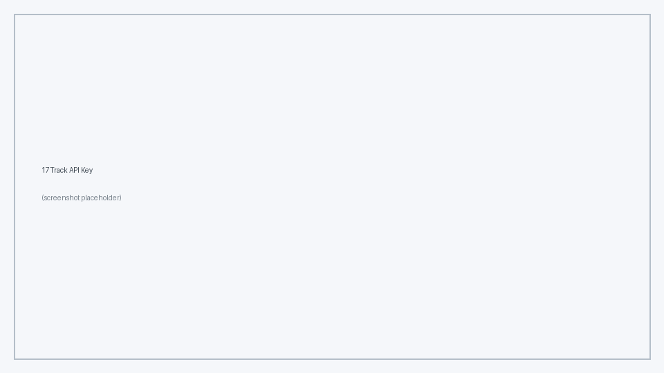
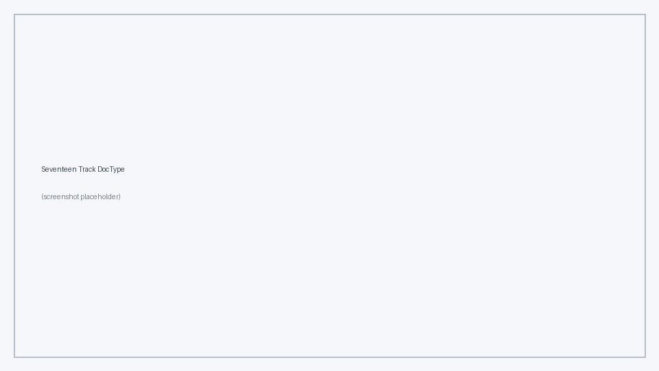
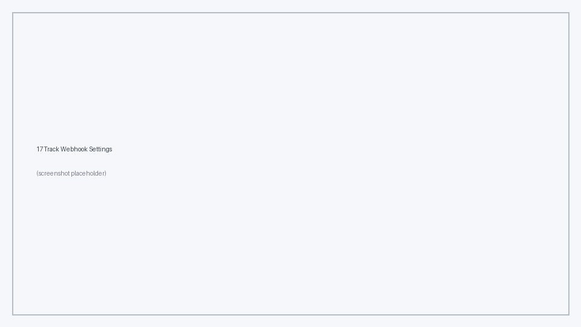

<!-- Copyright (c) 2026, AgriTheory and contributors
For license information, please see license.txt-->

# 17Track Integration

<div class="byline">
  lauty95 2026-05-21
</div>

This integration connects [17TRACK](https://www.17track.net/) global shipment tracking with ERPNext via the Shipstation Integration app.  
It enables automatic tracking, status sync, and comment logging for shipments handled via 17TRACK.

---

## Features

- **Automatic tracking updates via webhook from 17TRACK**
- **Carrier management** for fast lookup and autosuggest
- **Configurable comment logging** on shipment status updates

---

## Setup

### Get a Seventeen Track API Key

- Go to https://admin.17track.net/api/settings and login or register




### **Seventeen Track Doctype**

- Go to **Seventeen Track** DocType.
- **Fields:**
  - `Company`: The ERPNext company this configuration applies to. _(Required)_
  - `API Key`: Your 17TRACK API key. _(Required)_
  - `Webhook Callback URL`: The URL you must register in the 17TRACK dashboard under **API Settings → WebHook**. This field is read-only and is generated automatically from your site URL.
  - `Add Updates as Comments`: Enable to log each tracking status update as a comment on the Tracking Number record.
  - `Enable Geocoding`: When checked, events that do not include coordinates from the carrier are resolved via the configured geocoding service (default: Nominatim/OpenStreetMap). Disable this if you do not want external geocoding calls or have not configured a provider. See the [Tracking Map](./tracking_map.md) documentation for details.



### Permissions

On install, the app creates a **17Track Integration** role (no Desk access). Webhook-driven updates on **Tracking Number** records run under this role so API callbacks do not require an interactive user session.

---

## Webhook Integration

### **Endpoint**

`/api/method/shipstation_integration.shipstation_integration.doctype.seventeen_track.seventeen_track.seventeentrack_webhook`

#### **How it works:**

- Register your URL on https://admin.17track.net/api/settings

You can send a test webhook from the 17TRACK panel



- Receives POST requests from 17TRACK on shipment status updates.
- Updates corresponding Shipment record:
  - Sets latest status, sub-status, description, event time, and carrier.
  - Optionally adds a comment if enabled in Seventeen Track settings.

---

## Example: Comment Logged on Shipment

If `Add Updates as Comments` is enabled, the following is added to Shipment as a comment on status update:

```
**17TRACK Update**

- **Status:** Delivered
- **Sub-status:** Delivered_Other
- **Sub-status description:** 
- **Event Time:** 2025-09-04 08:49:55.826975
- **Description:** Package delivered to recipient.
```
