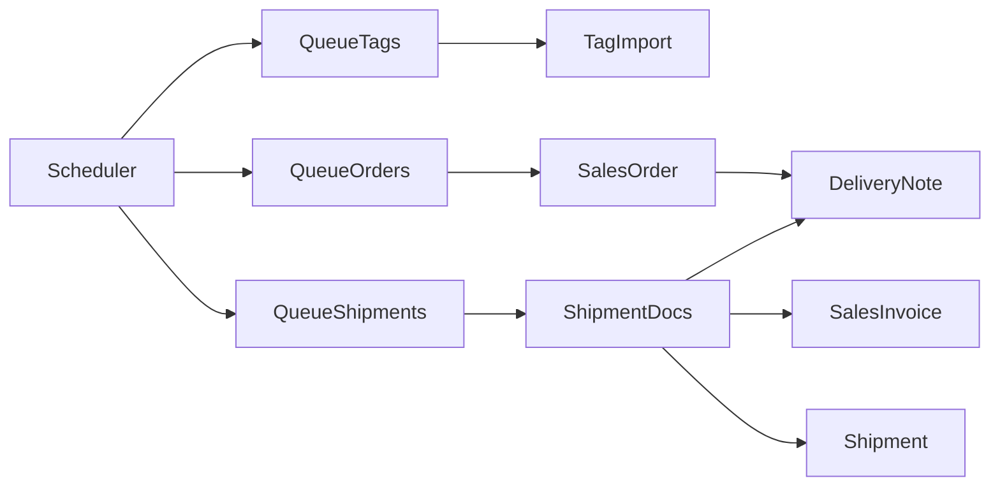

<!-- Copyright (c) 2026, AgriTheory and contributors
For license information, please see license.txt-->

# Order Sync

  AgriTheory 2026-06-24

Order sync imports marketplace orders, products, tags, and shipment data from ShipStation into ERPNext. The legacy v1 API drives scheduled and webhook-based sync; v2 is used for labels and fulfillments separately.

## Scheduled sync

The Frappe scheduler runs three jobs on every tick (`scheduler_events` → `all`):

| Job | Module | Queue |
|---|---|---|
| Tag import | `api.tags.queue_tags` | `shipstation` |
| Order import | `api.orders.queue_orders` | `shipstation` |
| Shipment import | `api.shipments.queue_shipments` | `shipstation` |

Each job enqueues a worker method only if the same job is not already queued, preventing duplicate runs.

All three require **Shipstation Settings** with **Enabled** and **Enable Legacy API (v1)**.

## Order import

For each enabled **Shipstation Settings** document, the order job iterates **Shipstation Stores** where **Pull Orders** is checked.

- Fetches orders modified in the last 24 hours (ShipStation API behaves inconsistently with shorter windows).
- Filters by store ID and respects **Since Date** on settings.
- Creates or updates **Sales Order** documents with customer, items, tax, shipping, and integration metadata.
- Creates **Customer** and **Item** records as needed using store account defaults.
- Applies marketplace hooks for Amazon (`update_shipstation_amazon_order`) and Shopify (`update_shipstation_shopify_order`) when configured.

Manual import: click **Get Orders** on **Shipstation Settings**.

Webhook import: see [Webhooks](./webhooks.md) — `ORDER_NOTIFY` events enqueue the same order-creation pipeline.

### Extension hooks

| Hook | Purpose |
|---|---|
| `update_shipstation_list_order_parameters` | modify API query parameters before list fetch |
| `process_shipstation_order` | return `False` to skip creating a Sales Order |
| `process_shipstation_order_items` | transform line items before SO append |

## Shipment import

For each store with **Pull Shipments** and at least one create flag (**Create Sales Invoice**, **Create Delivery Note**, **Create Shipment**), the shipment job fetches recent ShipStation shipments.

Depending on store flags, the integration may:

1. Create a submitted **Sales Invoice** from the linked Sales Order
2. Create a **Delivery Note** from the Sales Order or Sales Invoice
3. Create an ERPNext **Shipment** from the Delivery Note

Shipments before **Since Date** are skipped. Already-fulfilled Delivery Notes (matching `shipstation_order_id`) are skipped unless voided.

Manual import: click **Get Shipments** on **Shipstation Settings**.

## Product and tag import

- **Get Items** — import/update Item records from ShipStation product catalog (uses **Default Item Group**).
- **Get Tags** — sync ShipStation tags into ERPNext **Tag** documents (runs under **ShipStation User** if set).

Tag import also runs on the scheduler via `queue_tags`.

## Store-level controls

Each store row controls whether it participates in sync. See [Shipstation Stores](./shipstation_stores.md) for **Pull Orders**, **Pull Shipments**, and document-creation flags.

## Configuration

Configure API credentials and **Since Date** on [Shipstation Settings](./shipstation_settings.md). Per-store behavior is on [Shipstation Stores](./shipstation_stores.md). Ensure the `shipstation` worker queue is running — see [Background Jobs](./background_jobs.md).
