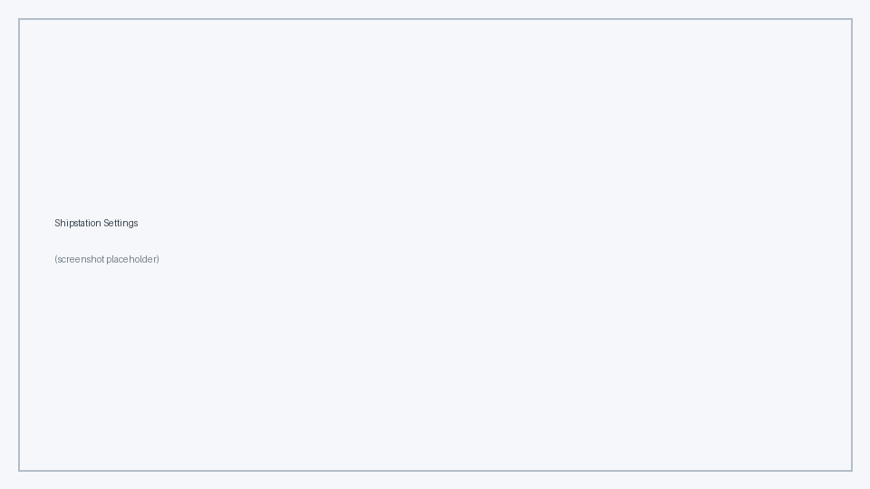

<!-- Copyright (c) 2026, AgriTheory and contributors
For license information, please see license.txt-->

# Shipstation Settings

  AgriTheory 2026-06-24

**Shipstation Settings** is the central configuration document for each connected ShipStation account. Create one record per account and enable the API versions you need.

## Enabling the integration

1. Open **Shipstation Settings** from the Awesome Bar.
2. Check **Enabled**.
3. Configure at least one API section (v1, v2, or both).
4. Save the document. On save, the app registers webhooks (see [Webhooks](./webhooks.md)) and can sync carrier data.

## API options

This integration supports the classic ShipStation API (v1), ShipStation API v2, or both:

| Feature | v1 Only | v2 Only | Both |
|---------|:-------:|:-------:|:----:|
| Order sync from marketplaces | ✓ | | ✓ |
| Auto-shipment creation | ✓ | | ✓ |
| Store management | ✓ | | ✓ |
| Rate shopping before purchase | | ✓ | ✓ |
| Direct label purchase | | ✓ | ✓ |
| Fulfillment push to marketplaces | | ✓ | ✓ |
| Tags and product import | ✓ | | ✓ |

**v1 only** — Use when you need to sync orders from ShipStation-connected marketplaces (Amazon, Shopify, etc.) and generate labels through ShipStation's order workflow.

**v2 only** — Use when you need to ship packages and compare rates without marketplace integrations. Labels can be purchased directly without orders existing in ShipStation.

**Both** — Order management flows through v1; v2 provides rate shopping and direct label purchase. This is the recommended setup for full functionality.

### Legacy API (v1)

- **Enable Legacy API (v1)** — turn on v1 order and shipment sync.
- **API Key** / **API Secret** — credentials from your ShipStation account.
- **Get Items**, **Get Orders**, **Get Shipments**, **Get Tags** — manual sync buttons (perm level 1).
- **Update Carriers and Stores** — refresh carrier list and store child rows from ShipStation.

### ShipStation API v2

- **Enable ShipStation API v2** — turn on rate shopping, direct labels, and fulfillment sync.
- **ShipStation API Key** — v2 API key from ShipStation account settings.
- **Test API Connection** — verify credentials.
- **Fetch API Carriers** / **Sync Carrier Packages** — import v2 carrier and package metadata.

When v2 is enabled and an API key is saved, the system can automatically create or update **Freight Carrier Settings** rows for LTL (see [LTL](./ltl.md)).

## Other settings

### Filters

- **Since Date** — orders and shipments created before this date are ignored. Useful after a stock reconciliation to avoid importing historical orders.

### Warehouses

The **Shipstation Warehouses** child table maps ShipStation warehouse IDs to ERPNext warehouses. Use **Fetch All** (v1 required) to pull warehouse data from ShipStation, then link each row to an ERPNext **Warehouse**.

### Stores

The **Shipstation Stores** child table lists marketplace stores linked to this account. Configure each store's company, warehouse, and document-creation flags on [Shipstation Stores](./shipstation_stores.md).

### Carriers (v1)

The **Carrier Data** section stores v1 carrier, service, and package metadata used for label generation. Refresh via **Update Carriers and Stores**.

### Label generation (v1)

- **Enable Label Generation** — show label-generation actions on Delivery Notes when v1 is configured. Requires **Enabled** on the settings document.

See [Labels and Rate Shopping](./labels_and_rates.md) for v2 label workflows.

### Cartonization

See [Cartonization](./cartonization.md) for multi-bin packing settings (`enable_cartonization`, auto-cartonize flags, solver mode, container doctypes JSON).

### GS1 / SSCC

See [GS1 / SSCC](./gs1_sscc.md) for the **GS1 Company Prefix** field used when generating SSCC-18 codes.

### Defaults

- **Default Item Group** — item group assigned to products imported from ShipStation.
- **Weight Conversion** — how item weights from ShipStation are stored (`As Provided`, `Convert to Gram`, `Convert to Ounce`).
- **ShipStation User** — user context used when importing tags (tags are created under this user).

## Configuration

All fields above live on the **Shipstation Settings** document. Store-specific overrides are in the **Shipstation Stores** child table.

